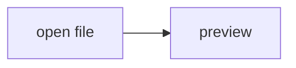

# Security regression checks

Open this file in Notepad++ with the AnotherMarkdown preview panel visible.
Run it in a sandbox (e.g. Sandboxie) when testing a build you do not trust yet.
Every payload below is inert on a fixed build; on a vulnerable build it makes
itself visible (a red banner or a launched program) but does nothing else.

Expected result for the whole file: **no red banner anywhere, no program is
launched by any link, and the regression section at the end still works.**

## 1. Scripts inside the document must not run

Inline script:

<script>document.body.insertAdjacentHTML('afterbegin','<h1 style="color:red;background:yellow">FAIL 1a: inline script executed</h1>')</script>

Script with external src (assets host is trusted, so a document must not be able to
load anything from it either):

<script src="http://assets.example/pano360/editor.js"></script>

Event handler attribute:

FAIL 1b: onerror handler executed</h1>')">

`javascript:` link (clicking it must do nothing):

<a href="javascript:document.body.insertAdjacentHTML('afterbegin','<h1 style=\'color:red;background:yellow\'>FAIL 1c: javascript: link executed</h1>')">click me - nothing should happen</a>

SVG with script:

<svg width="10" height="10"><script>document.body.insertAdjacentHTML('afterbegin','<h1 style="color:red;background:yellow">FAIL 1d: svg script executed</h1>')</script></svg>

## 2. Links must only open http(s)/mailto through the shell

Clicking these must NOT launch anything (before the fix, `file:` links were passed
straight to `ShellExecute`):

* [file: link to calc.exe](file:///C:/Windows/System32/calc.exe)
* [UNC-style link](file://localhost/C:/Windows/System32/calc.exe)
* [custom protocol](ms-calculator:)

These SHOULD still work:

* [https link - opens in the default browser](https://example.com/)
* <a href="https://example.com/" target="_blank">target=_blank link - opens in the default browser, NOT in a new popup WebView window</a>
* [mailto link - opens the mail client](mailto:test@example.com)
* [link to another markdown file - opens it in Notepad++](Test-MD.md)

## 3. Embedded content

Nothing below this line should show a frame or a form control that submits:

<iframe src="https://example.com/" width="300" height="100"></iframe>

<form action="http://api.example/paste-image" method="post" enctype="multipart/form-data">
  <input type="hidden" name="image" value="x">
  <button type="submit">FAIL 3 if this looks like a working form button</button>
</form>

<object data="https://example.com/"></object>
<embed src="https://example.com/">

<meta http-equiv="refresh" content="0;url=https://example.com/">
<base href="https://example.com/">

## 4. Endpoint protection (manual, needs DevTools)

Press F12 in the preview panel (or right click -> Inspect) and run in the console:

```js
// directory listing without the token -> expect 403
fetch('http://local.example/diskC/*.*').then(r => console.log('listing', r.status));
// PUT the document without the token -> expect 403 and the editor text unchanged.
// DOC is the URL of this file as shown in the Network tab (GET http://local.example/disk.../Test-Security.md)
fetch(DOC, { method: 'PUT', body: 'x' }).then(r => console.log('put', r.status));
fetch('http://api.example/webevent', { method: 'POST', body: '{}' }).then(r => console.log('webevent', r.status));
fetch('http://api.example/paste-image', { method: 'POST', body: '' }).then(r => console.log('paste', r.status));
```

All four must report `403`. (Requests made by the page itself carry the
`X-AnotherMarkdown-Token` header, which is why the checkbox below still works.)

## 5. Regression - things that must still work

- [ ] clicking this checkbox toggles `[ ]` / `[x]` in the editor (PUT with token)
- [x] and back again

Paste an image from the clipboard or drag one into the preview: it must be saved
into `./img/` next to this file and `` inserted at the caret.

Math (enable the *katex* extension): $E = mc^2$

Mermaid (enable the *mermaid* extension):



Code highlighting (enable *highlightjs*):

```csharp
var ok = WebSession.IsAuthorized(request, token);
```

Image with a relative, URL-encoded, non-ASCII path (relative references, including
`../` ones outside the document folder, must keep working):


<details open><summary>details / summary</summary>still renders</details>

<style>.security-test-style { color: green; font-weight: bold }</style>
<p class="security-test-style">Custom inline style still applies (green, bold).</p>
