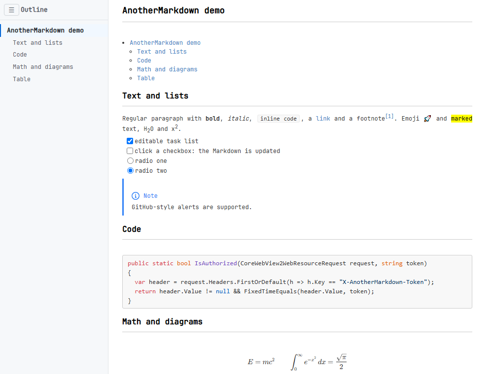
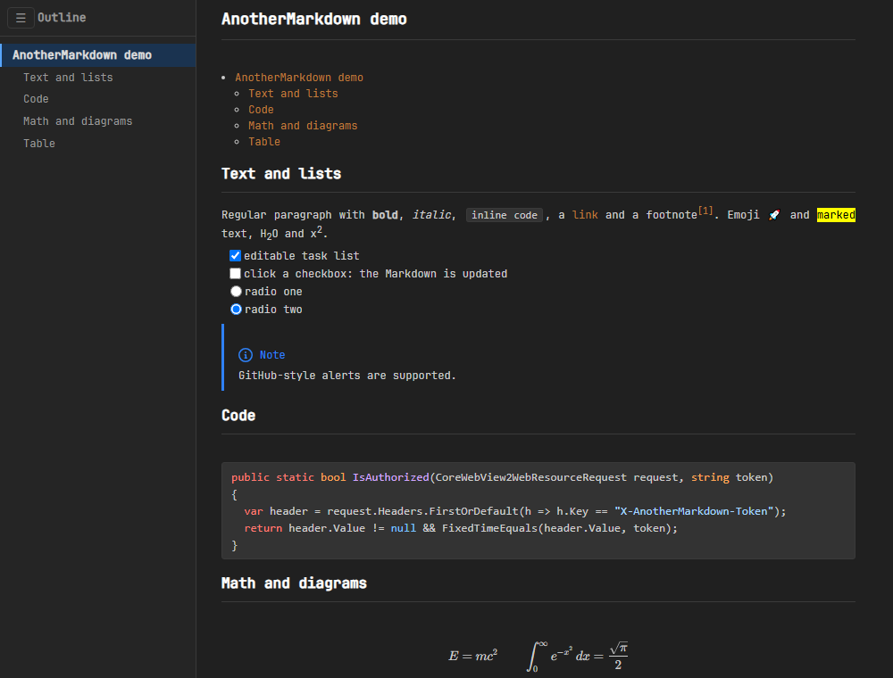
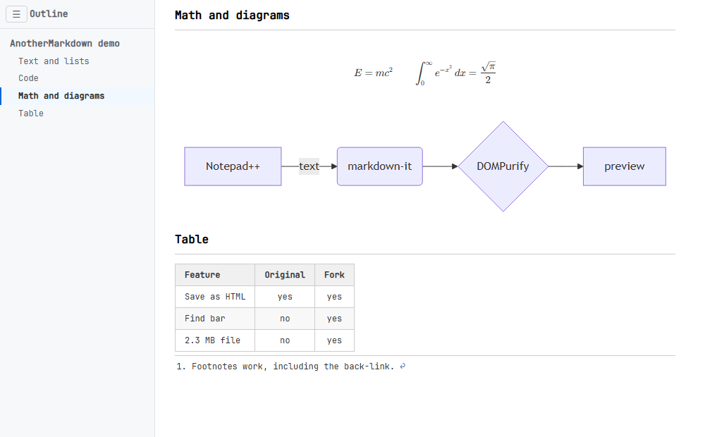
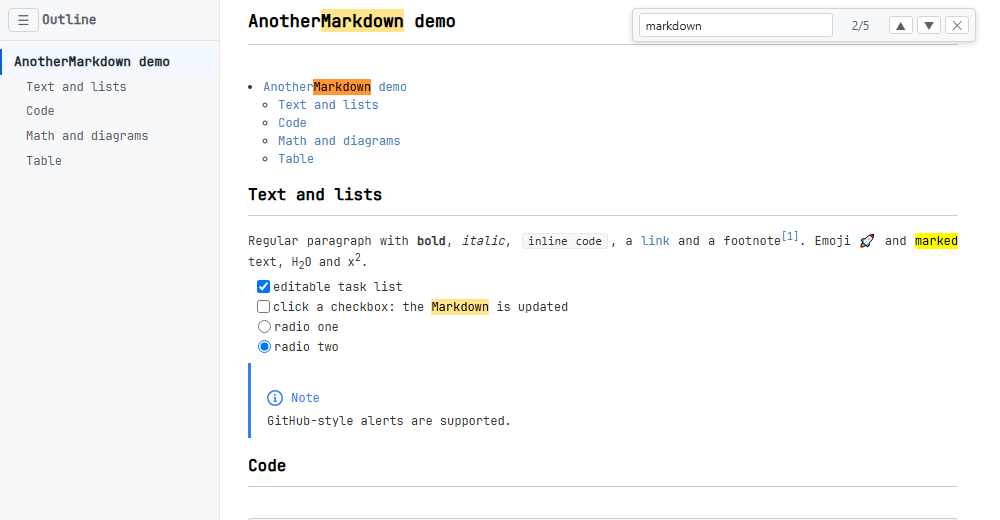
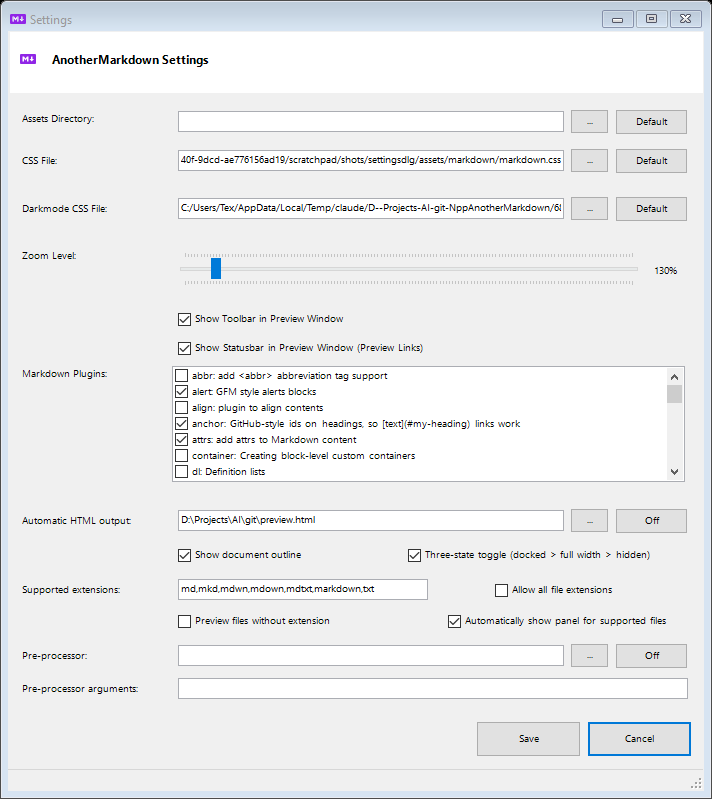

# AnotherMarkdown for Notepad++

A plugin for previewing Markdown files in Notepad++.

* Lightweight plugin to preview Markdown within Notepad++
* Displays rendered Markdown HTML using **WebView2 (Edge)**

The plugin is a fork of the [NppMarkdownPanel plugin](https://github.com/mohzy83/NppMarkdownPanel) and uses the [markdown-it](https://github.com/markdown-it/markdown-it) javascript library to render Markdown documents into HTML and allows configuring used Markdown extensions **without recompiling or reinstalling the plugin** (just edit `assets/markdown/markdown.js`).

## Supported markdown extensions (out-of-box)

| Extension                                                      | Description                            |
|----------------------------------------------------------------|----------------------------------------|
| [abbr](https://mdit-plugins.github.io/abbr.html)               | Add abbreviation tag \<abbr> support   |
| [alert](https://mdit-plugins.github.io/alert.html)             | GFM style alerts                       |
| [align](https://mdit-plugins.github.io/align.html)             | Plugin to align contents               |
| [attrs](https://mdit-plugins.github.io/attrs.html)             | Add attrs to Markdown content          |
| [container](https://mdit-plugins.github.io/container.html)     | Creating block-level custom containers |
| [dl](https://mdit-plugins.github.io/dl.html)                   | Definition list |
| [emoji](https://github.com/markdown-it/markdown-it-emoji)      | Emoji |
| [figure](https://mdit-plugins.github.io/figure.html)           | Generating figures with captions from images |
| [footnote](https://mdit-plugins.github.io/footnote.html)       | Footnotes |
| anchor                                                         | GitHub-style ids on headings, so `[text](#my-heading)` links work ([markdown-it-anchor](https://github.com/valeriangalliat/markdown-it-anchor)) |
| toc                                                            | `[toc]` (or `[[toc]]`, `${toc}`) on a line of its own is replaced by a table of contents ([markdown-it-toc-done-right](https://github.com/nagaozen/markdown-it-toc-done-right)) |
| frontmatter                                                    | YAML front matter (a `---` block at the top of the file) is shown as a `yaml` code block instead of being rendered as Markdown |
| [highlight.js](https://github.com/highlightjs/highlight.js)    | Code syntax highlight |
| [icon](https://mdit-plugins.github.io/icon.html)               | Icons |
| [imgLazyLoad](https://mdit-plugins.github.io/img-lazyload.html)| Lazy loading for images |
| [imgMark](https://mdit-plugins.github.io/img-mark.html)        | Mark images by ID suffix for theme mode |
| [imgSize](https://mdit-plugins.github.io/img-size.html)        | Add support setting size for images |
| [ins](https://mdit-plugins.github.io/ins.html)                 | Аdd \<insert\> tag support |
| [katex](https://mdit-plugins.github.io/katex.html)             | Math Expressions   |
| [mark](https://mdit-plugins.github.io/mark.html)               | Mark and highlight contents |
| [pano360]()                                                    | Editing and preview interactive 360-degree panoramic photos. It uses [panellum](https://github.com/mpetroff/pannellum) library and invokes with markdown markup syntax ``. Example can be found [here](./example/pano/index.md).  Editing index.pano360.json in Notepad++ allow interactive add hotspots and transition between photos, makes scene editing easier.|
| [plantuml](https://mdit-plugins.github.io/plantuml.html)       | Add support plant uml schemes |
| [mermaid](https://mermaid.js.org/)                             | Render mermaid diagrams (flowchart, sequence, gantt, ...) from `mermaid` fenced code blocks  |
| [ruby](https://mdit-plugins.github.io/ruby.html)               | Ruby annotation \<ruby\> |
| [qrcode]()                                                     | Display QRCode from string `` |
| [spoiler](https://mdit-plugins.github.io/spoiler.html)         | Plugin for hide content |
| [stylize](https://mdit-plugins.github.io/stylize.html)         | Plugin for stylizing tokens |
| [sub](https://mdit-plugins.github.io/sub.html)                 | Plugin to support subscript |
| [sup](https://mdit-plugins.github.io/sup.html)                 | Plugin to support superscript |
| [tab](https://mdit-plugins.github.io/tab.html)                 | Block-level custom tabs |

### Latest Version

The latest version can be found [here](https://github.com/ezyuzin/NppAnotherMarkdown/releases).

### ChangeLog

Differences between versions can be found [here](./CHANGELOG.md).

## Prerequisites
- Windows
- .NET 4.7.2 or higher

## Installation
#### Installation in Notepad++ 
The plugin can be installed with the Notepad++ Plugin Admin.
The name of the plugin is **AnotherMarkdown**.

#### Manual Installation
Create the folder "AnotherMarkdown" in your Notepad++ plugin folder (e.g. "C:\Program Files\Notepad++\plugins") and extract the appropriate zip (x86 or x64) to it.

It should look like this:  

**Issues with manual installation:**
Windows blocks downloaded DLLs by default. That means you likely get the following error message: 

> Failed to load  
> AnotherMarkdown.dll is not compatible with the current version of Notepad++

Make sure to unblock __all__ DLLs of the plugin (also DLLs in subfolders).  

**Note for Windows 7 users:**
 WebView2 Edge is required for the plugin to function properly. 
 Windows 7 does not include WebView2 Edge by default, so you must manually install the WebView2 Runtime from Microsoft's WebView2 download page before using the plugin.
 https://developer.microsoft.com/en-us/microsoft-edge/webview2?form=MA13LH#download
## Usage

After the installation you will find a small purple markdown icon in your toolbar.
Just click it to show the markdown preview. Click again to hide the preview.
Thats all you need to do ;)

The preview with the document outline, a table of contents, editable task/radio lists, a GitHub-style alert, highlighted code and KaTeX:

With dark mode enabled in Notepad++:

Mermaid diagrams, tables and footnotes; the outline follows the scroll position:

The find bar (`Ctrl+F`):

### Settings

To open the settings for this plugin: Plugins -> AnotherMarkdown -> Settings

* #### CSS File
    This allows you to select a CSS file to use if you don't want the default style of the preview
	
* #### Dark mode CSS File
	This allows you to select a Dark mode CSS file. When the Notepad++ dark mode is enabled, this Css file is used.
	When no file is set, the default dark mode Css is used.

* #### Zoom Level
    This allows you to set the zoom level of the preview

* #### Automatic HTML Output
    This allows you to select a file to save the rendered HTML to every time the preview is rendered. This is a way to automatically save the rendered content to use elsewhere. Leave it empty (button *Off*) to disable the automatic saving.  
    __Note: This is a global setting, so all previewed documents will save to the same file.__

* #### Show Toolbar in Preview Window
    Checking this box will enable the toolbar in the preview window (Export / Copy HTML buttons). By default, this is unchecked.

* #### Show Statusbar in Preview Window (Preview Links)
    Checking this box will show the status bar, which previews the target of the link under the mouse. By default, this is unchecked.

* #### Show document outline
    Shows a sidebar with the headings of the document. Click a heading to jump to it; the entry of the heading currently at the top of the preview is highlighted. The burger button (&#9776;) collapses/expands the sidebar. Also available as *Plugins -> AnotherMarkdown -> Show outline*.

* #### Three-state toggle (docked > full width > hidden)
    Changes the behaviour of *Toggle Markdown Panel*: with this option the panel cycles through hidden -> docked -> full width (the editor pane is pushed away so only the preview is visible) -> hidden. Without it the panel just toggles between docked and hidden.

* #### Supported extensions / Allow all file extensions
    Comma separated list of file extensions that are rendered as Markdown (default `md,mkd,mdwn,mdown,mdtxt,markdown,txt`). Other files show a short notice instead. *Allow all file extensions* skips the check - be careful, rendering large logs or source files as Markdown can be slow.

* #### Preview files without extension
    Also renders files that have no extension (e.g. "new 2").

* #### Automatically show panel for supported files
    When switching tabs (or after Save As / rename), the panel is opened for files with a supported extension and closed for other files.

### Export (Plugins -> AnotherMarkdown, or the preview window toolbar)

* #### Save as HTML...
    Saves the rendered preview as a standalone HTML document: all stylesheets are inlined and image/link paths are made absolute, so the file can be moved anywhere.

* #### Save as HTML (light theme)...
    The same, but always with the light stylesheet (even while Notepad++ dark mode is enabled).

* #### Copy HTML to clipboard
    Copies the rendered preview to the clipboard as formatted text (`CF_HTML`, pastes with formatting into Word, Outlook, ...) and as plain HTML source for text editors.

* #### Export to PDF...
    Prints the current preview to a PDF file.

### Working in the preview

* **Find** - press `Ctrl+F` (or `F3`) while the preview has the focus, use the *Find* toolbar button or *Plugins -> AnotherMarkdown -> Find in preview...*. All matches are highlighted; `Enter` / `Shift+Enter` (or `F3` / `Shift+F3`) step through them, `Esc` closes the bar.
* **Double-click** anywhere in the preview to move the editor caret to the corresponding line of the Markdown source.
* **Links** to other Markdown files (or any file with a supported extension) open in Notepad++; `http(s)` and `mailto` links open in the default browser / mail client; everything else is ignored. `#anchor` links jump within the document.
* **Code blocks** show a *Copy* button when hovered.
* **Images** that are displayed smaller than their real size open full size when clicked (`Esc` or click to close).
* **Zoom** with `Ctrl` + mouse wheel; the new zoom level is kept as the setting.
* **Status bar** (when enabled) shows the target of the link under the mouse, otherwise the word count and an estimated reading time.
* *Plugins -> AnotherMarkdown* also has **Refresh preview**, **Print...** and **Open in browser**.

### Editable task lists and radio lists

With the `tasks-list` extension enabled, `- [ ]` / `- [x]` items render as checkboxes and `- ( )` / `- (x)` items as radio buttons. Clicking them updates the Markdown in the editor. Radio buttons of one list form a group: selecting one clears the others; clicking the selected one clears it.

### Pre-processor

A program can be configured (Settings -> *Pre-processor* and *Pre-processor arguments*) that rewrites the Markdown before it is rendered, e.g. to expand custom macros. `%inputfile%` and `%outputfile%` in the arguments are replaced with temporary file names; the program must write its result to `%outputfile%`. The default arguments are `%inputfile% %outputfile%`. An example C# project is in `misc\PPExtensions`. The same values live in `plugins\Config\AnotherMarkdown.ini` as `PreProcessorExe` / `PreProcessorArguments`.

### Synchronize viewer with caret position

Enabling this in the plugin's menu (Plugins -> AnotherMarkdown) makes the preview panel stay in sync with the caret in the markdown document that is being edited.  
This is similar to the _Synchronize Vertical Scrolling_ option of Notepad++ for keeping two open editing panels scrolling together.

### Synchronize with first visible line in editor

When this option is enabled, the plugin ensures that the first visible line in the 
editor is also visible in the preview. (This is an alternative to _Synchronize viewer with caret position_)

### Used libs and resources

| Name                              | Version     | Authors       | Link                                                                                                                   |
|-----------------------------------|-------------|---------------|------------------------------------------------------------------------------------------------------------------------|
| NotepadPlusPlusPluginPack.Net     | 0.95    	  | kbilsted      | [https://github.com/kbilsted/NotepadPlusPlusPluginPack.Net](https://github.com/kbilsted/NotepadPlusPlusPluginPack.Net) |
| NppMarkdownPanel                  | 0.9.0    	  | mohzy83       | [https://github.com/mohzy83/NppMarkdownPanel](https://github.com/mohzy83/NppMarkdownPanel) |
| EdgeViewer                        | 1.0.9    	  | rg-software   | [https://github.com/rg-software/wlx-edge-viewer](https://github.com/rg-software/wlx-edge-viewer) |
| WebView2 Edge				              | 1.0.3296.44 | Microsoft     | [https://developer.microsoft.com/de-de/microsoft-edge/webview2?form=MA13LH](https://developer.microsoft.com/de-de/microsoft-edge/webview2?form=MA13LH) |
| Markdown Icon                     |             | dcurtis       | [https://github.com/dcurtis/markdown-mark](https://github.com/dcurtis/markdown-mark)                                   |

### Contributors

## License
This project is licensed under the MIT License - see the LICENSE.txt file for details
